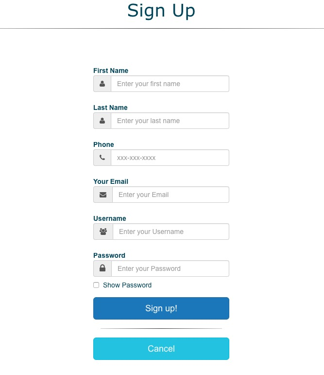
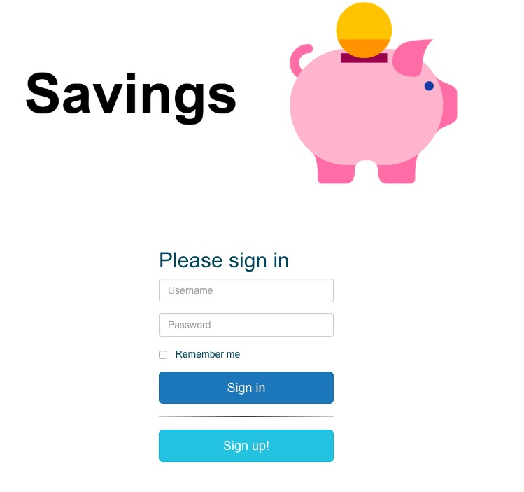
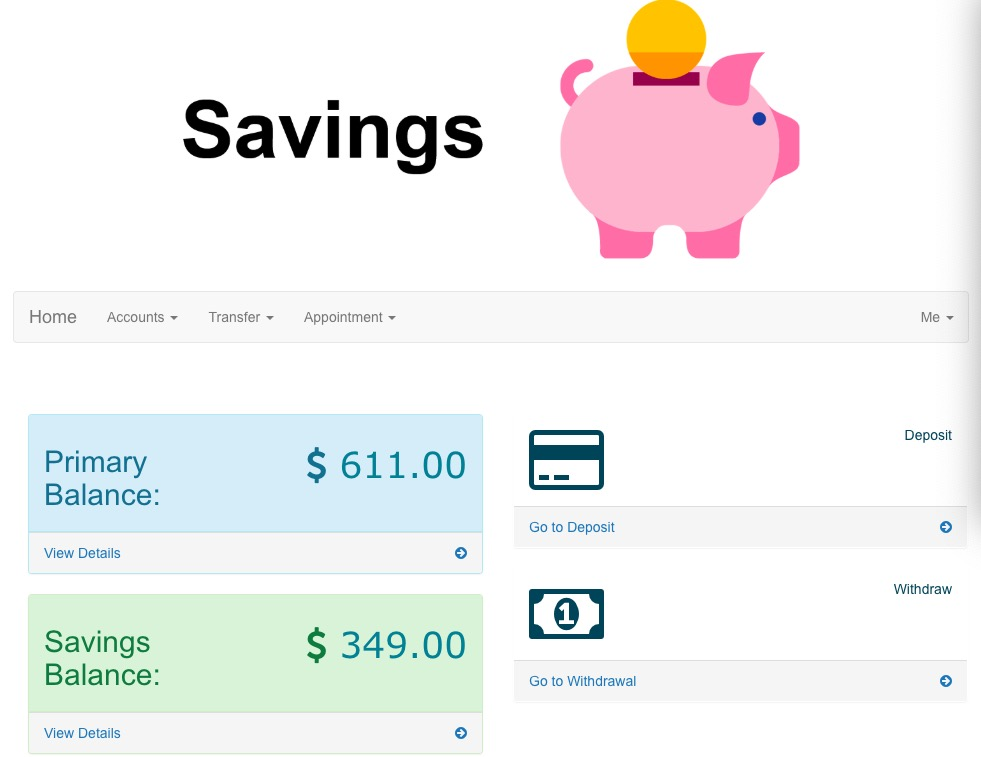
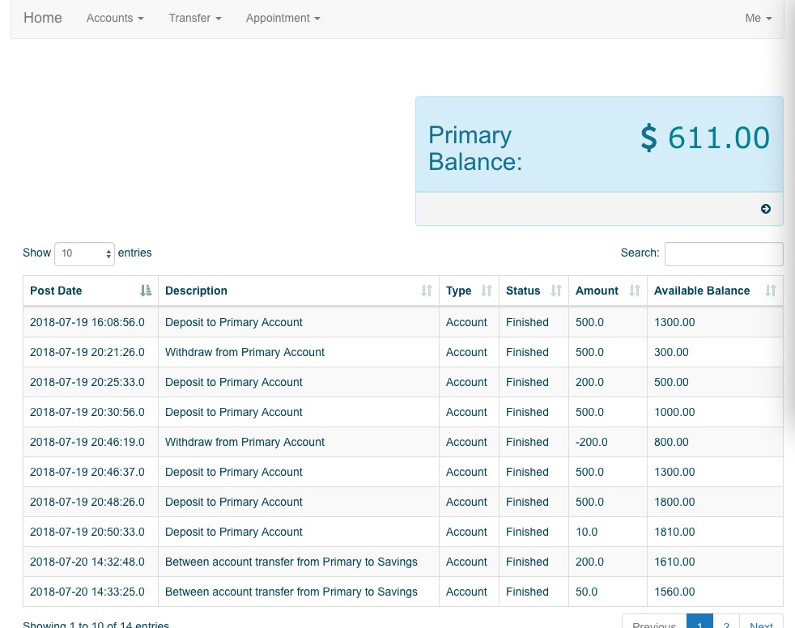
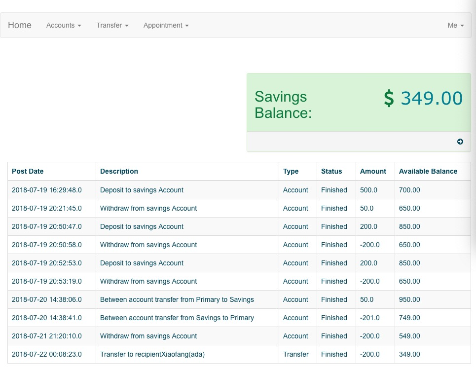
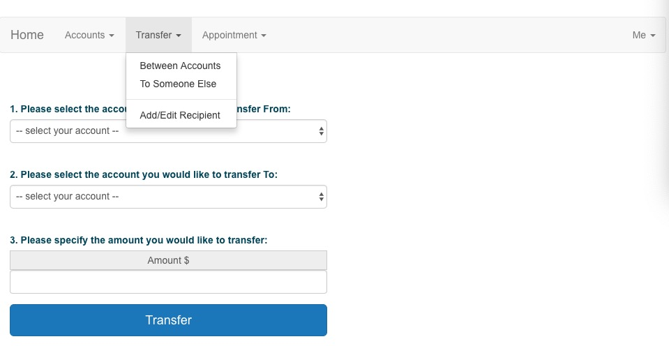
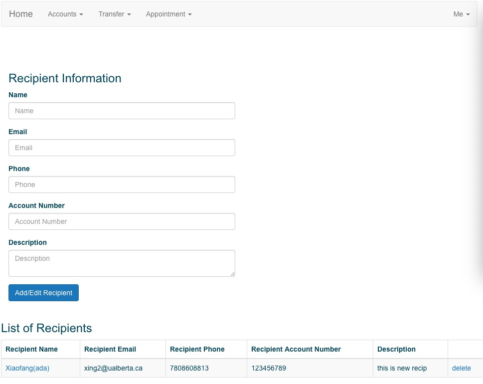
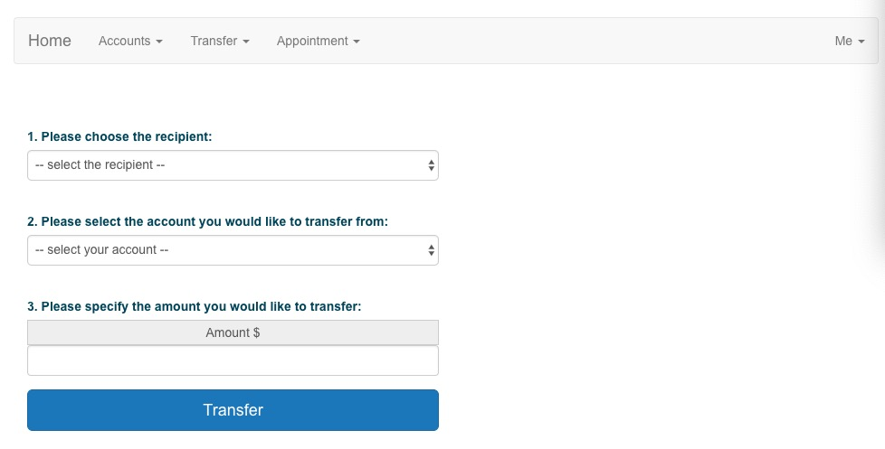
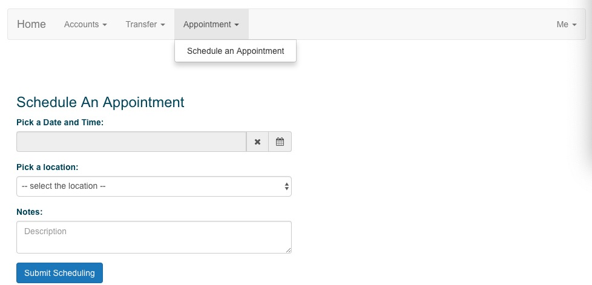
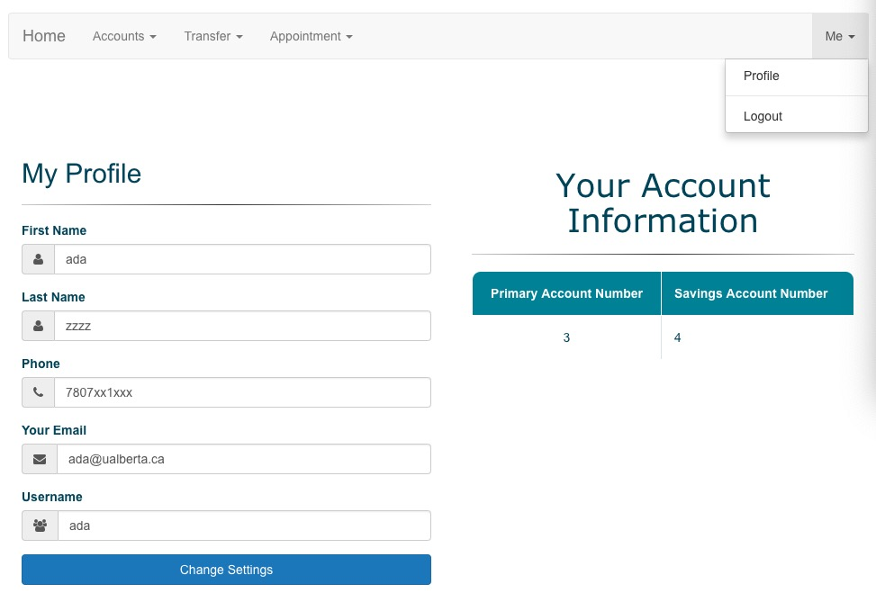

# online_bank

- I am learning from Udemy to make online_bank project. It is a project with combination of frontend and backend.
  - frontend: Angular 
  - backend: Java spring
- Currently, it has basic user functions
    - register new user 
    
    - login 
    
      - account
      
        - primary account
        
        - saving account
        
      - transaction
        - deposit
        - withdraw
      - transfer
      
        - between-account
        - add/delete recipient
        
        - to someone else
        
      - appointment
      
        - schedule
      - profile 
      

- This is all that I have done so far, not finished yet, will update more later with more edition. 
- Since it needs angular2 for later function, I need to learn it:(

## Available Scripts
In the project directory, you can run in Eclipse IDE:

### Click folder `run as Spring Boot App`
start the application
 

